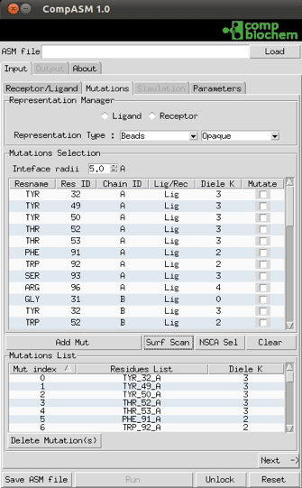
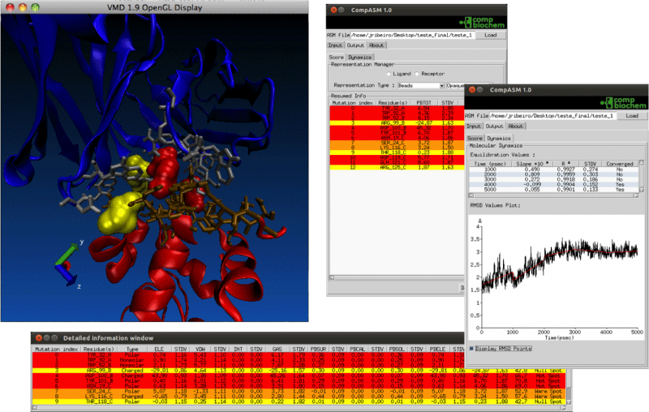
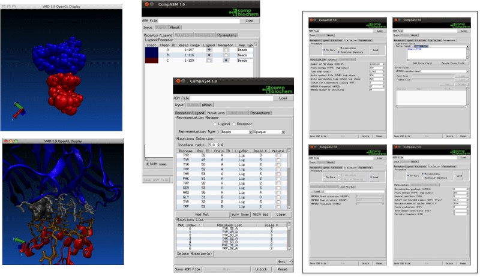
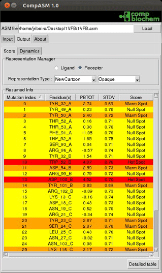
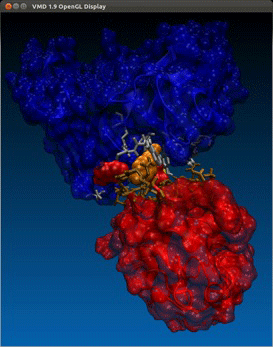

# Introduction
Protein-protein interactions play a crucial role in molecular recognition and cellular function. Mapping them, provides important insight on how these structures interact and on how to improve or inhibit their binding.

CompASM presents here as a very intuitive plug-in for two widely distributed softwares ( AMBER-Visual Molecular Dynamics (VMD)) that allows the user to perform a full Alanine Scanning Mutagenesis (ASM) procedure, requiring only very little user effort. This software is composed by two main packages: the Core and Graphical User Interface (GUI).

The CompASM Core section (Amber dependent, VMD independent) contains the main procedures of the ASM algorithm, e.g. Molecular Dynamics Simulation and MMPBSA calculation. It can be launched in a shell command and/or with the “Run” button of the GUI.

The CompASM GUI section (Amber independent, VMD dependent) turns possible the communication between Amber and VMD. Here, the user can generate the input file and submit it to the CompASM Core automatically, as well as being able to visualize the interfaces and the final results.

## Minimum Requirements

Operating System: macOS, Linux or Windows
Visual Molecular Dynamics (VMD) 1.9.1 or later

## Installation

You could install compASM through [vmdStore](https://github.com/BioSIM-Research-Group/vmdStore) (Recommended).

## Contacts
If you have any suggestion of new features, please contact us: nscerque@fc.up.pt

## Citation
Ribeiro, J.V., Cerqueira, N.M.F.S.A., Moreira, I.S. et al. Theor Chem Acc (2012) 131: 1271. 

## DOI
https://doi.org/10.1007/s00214-012-1271-2
